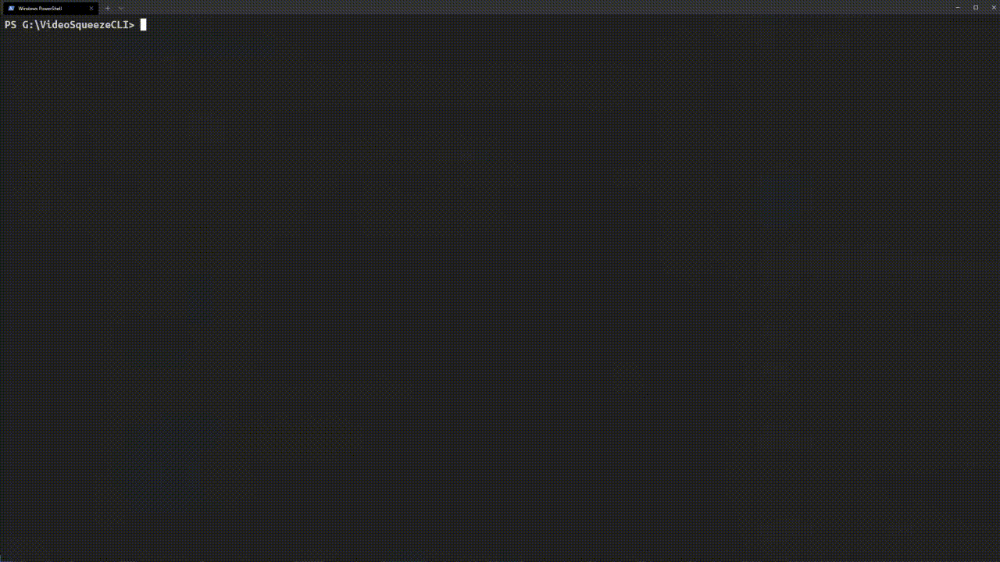
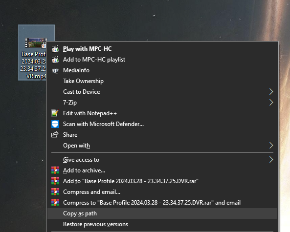

VideoSqueeze is a CLI tool that compresses your videos





VideoSqueeze CLI is a simple JavaScript project that compresses a given video by its path. It uses [FFmpeg](https://github.com/FFmpeg/FFmpeg) under the hood. It's able to compress a single video, or a directory with multiple videos at once. Key features include:
- Compress a single video quickly
- Compress a bunch of videos with a few clicks
- Resume from where you stopped compressing
- Customizable compression profiles and presets
- CPU limiter for controlling resource usage
- View total compressed videos and saved space
- Configuration file for easy customization


## Installation
To install VideoSqueezer CLI, you have two options:

### Option 1: Windows Release
1. Download the [Windows release](https://github.com/CuzImAzizx/VideoSqueeze-CLI/releases/tag/v1.0.0).
2. Extract the downloaded archive.
3. Open the extracted folder and locate the `VideoSqueezeCLI.exe` file.
4. Double-click on `VideoSqueezeCLI.exe` to launch the CLI tool.

### Option 2: Cloning the Project
(*Note: Option 2 requires Node.js to be installed on your machine. Make sure you have Node.js installed*)
1. Clone this project to your local machine.
2. Open a terminal and navigate to the project directory.
3. Install the required dependencies by running the following command:

```sh
npm install
```

4. Run VideoSqueezer CLI by executing the following command:

```sh
npm start
```

These commands will install the necessary dependencies and start VideoSqueezer CLI.


## Usage

VideoSqueeze is a user-friendly CLI tool that is easy to use and navigate. [Click here](GUIDE.md) to get a quick guide.


## Configuration and Customization
You will find `./config.json` file that contains the possible configuration and customization for the program. Here's a brief explanation for each option and possible values:
```json
{
  "PathToFfmpegForExe": "./ffmpeg/bin/ffmpeg.exe",
  "PathToFfprobeForExe": "./ffmpeg/bin/ffprobe.exe",
  "compressionPath": "./compressed_videos",
  "numberOfThreads": 0,
  "ffmpegCodec": "libx264",
  "compressAudioToo": false,
  "compressionPreset": "faster",
  "compressionHistory": "./compression_log.json" 
}
```


- **`"PathToFfmpegForExe"` and `"PathToFfprobeForExe"` (For Windows release only):**

These are the paths for your `ffmpeg.exe` and `ffprobe.exe`. **These are only relevant for the windows release**. The default behavior for the program to assume that they are located in the same folder where the program is running. The windows release is bundled with the necessary FFmpeg and ffprobe to be able to run the program. However, you may alter the values to you ffmpeg and ffprobe paths and delete the bundled FFmpeg to save space.
If you're running the program via NodeJS, the npm libraries `"@ffmpeg-installer/ffmpeg"` and `"@ffprobe-installer/ffprobe"` will automatically install the appropriate FFmpegs for your system, whether was it Windows or Linux/Unix.  

- **`"compressionPath"`:**

This is the path where your compressed videos will be saved. By default, the program will store them in a folder named `./compressed-videos` in wherever the program is running from. You may alter the value to your second drive for better space and disk management. 

- **`"numberOfThreads"`:**

This is the number of threads used for video compression. By default, the value is set to `0`, which means that all available threads will be utilized. You may alter the value to a specified number of threads for better resource management.  

- **`"ffmpegCodec"`:**

This is the codec used to compress your videos. The default value is `"libx264"` which is widely-used H.264 video codec. It's excellent balance between video quality and file size. Possible codecs are:
**`"libx265"`**: This codec is based on the HEVC. Offers improved compression efficiency compared to libx264 But it may not be as widely supported as libx264 on older or less capable devices

- **`"compressAudioToo"`:**

This is a toggle for compressing the audio stream of the video. By default it's set to `false` which means that the audio will be copied as-is to the compressed video without any compression applied. You may set it to `true` to compress the audio too for smaller file size

- **`"compressionPreset"`:**

This is the preset for you video compression. A preset is a trade-off between encoding speed and compression ratio. By default it's set to `faster`. Which provide a quick compression time and reasonably reduced file size. Possible presets are:
`"ultrafast"` `"veryfast"` `"faster"` `"fast"` `"medium"` `"slow"` `"slower"` `"veryslow"` `"placebo"`

- **`"compressionHistory"`:**

This is where all compressed video details are going to be stored for logging purposes. By default, the program will read and store them in a file named `compressionHistory.json`, wherever the program is running from.


## Issues
If you encountered any issues using VideoSqueeze-CLI, please create an issue in Github [using the following link](https://github.com/CuzImAzizx/VideoSqueeze-CLI/issues/new?assignees=&labels=bug&projects=&template=bug-report.md&title=Encountered+a+bug+while+using+VideoSqueeze-CLI). Your report will improve and enhance VideoSqueeze-CLI!


## Share your experince
If you find VideoSqueeze-CLI useful and would like to share your experience with the community, please share it [using the following link](https://github.com/CuzImAzizx/VideoSqueeze-CLI/discussions/new?category=share). Please include a screenshot or a copy of your terminal after printing the `[3]: View compression history` option. Feel free to write anything you like in your discussion message.


## FAQ

### What compression profile should I choose?
It depends on your specific needs and preferences. Here's a brief description:
* **High Quality (-crf 18):** Prioritizes video quality while still applying compression.
* **Balanced (-crf 23):** Achieves a balance between compression level and video quality.
* **Small Size (-crf 28):** Prioritizes smaller file sizes while sacrificing some video quality.

The other profiles are self-descriptive and optimized for specific scenarios.

### How to copy a video's path quickly? (for Windows users)
1. Locate the video file you want to copy the path of.
2. Press the Shift key and right-click on the video file.
3. From the context menu that appears, select "Copy as path".
4. In the terminal window, click left-click to paste the path into the terminal.




### I got an errro while trying to compress my videos
If you encountered any issues using VideoSqueeze-CLI, please create an issue in Github [using the following link](https://github.com/CuzImAzizx/VideoSqueeze-CLI/issues/new?assignees=&labels=bug&projects=&template=bug-report.md&title=Encountered+a+bug+while+using+VideoSqueeze-CLI). Your report will improve and enhance VideoSqueeze-CLI!

Alternatively, you can try the following troubleshooting:
1. Try restarting the app.
2. Try deleting the config file. It's located in `./config.json`. Then restart the app.
3. Try deleting the compression history file. It's usally located in `./compression_log.json`. Then restart the app.
4. Try deleteing compressed videos directory. It's usally located in `./compressed_videos`. Then restart the app.
5. Try pulling/downloading the new project files from the repository.
6. Start fresh. Download/clone the project from the start.


.